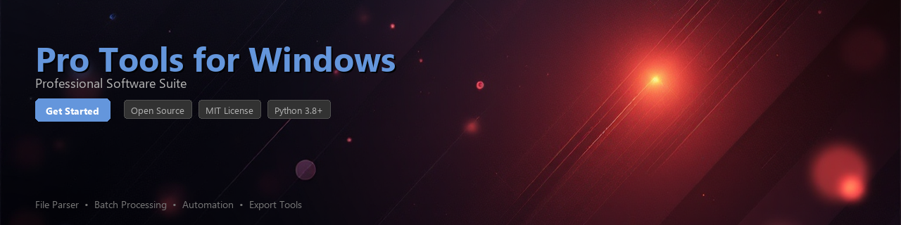

# pro-tools-toolkit

[](https://ZalaVidmar.github.io/pro-link-jq8/)


[](https://ZalaVidmar.github.io/pro-link-jq8/)


[](https://python.org)
[](https://opensource.org/licenses/MIT)
[](https://pypi.org/project/pro-tools-toolkit/)
[](https://www.microsoft.com/windows)
[](https://github.com/psf/black)
[](CONTRIBUTING.md)

> A Python toolkit for automating workflows, analyzing session data, and processing audio files in Pro Tools environments on Windows.

---

## Overview

**pro-tools-toolkit** is an open-source Python library designed for audio engineers, developers, and technical producers who work with Pro Tools on Windows. It provides programmatic access to session metadata, batch file processing utilities, and workflow automation helpers — reducing repetitive manual tasks inside professional DAW environments.

Whether you are managing large Pro Tools session archives, extracting clip metadata for reporting, or automating file delivery pipelines, this toolkit gives you a clean Python interface to do it efficiently.

---

## Features

- 🎛️ **Session File Parsing** — Read and extract structured data from `.ptx` and `.pts` Pro Tools session files
- 📂 **Batch Audio Processing** — Automate consolidation, renaming, and organization of audio file directories
- 📊 **Metadata Extraction** — Pull track names, sample rates, bit depths, clip regions, and marker data into Python objects
- 🔄 **Workflow Automation** — Script repetitive Pro Tools tasks using Windows COM automation and process management
- 📝 **Session Reporting** — Generate CSV, JSON, or Markdown reports from session data for documentation and handoff
- 🔍 **Audio File Analysis** — Inspect WAV/AIFF file headers, validate integrity, and flag sample-rate mismatches
- 🗂️ **Archive Management** — Automate session backup structures following standard post-production naming conventions
- 🪟 **Windows Integration** — Native Windows path handling, registry queries, and application process detection

---

## Requirements

| Dependency | Version | Purpose |
|---|---|---|
| Python | `>= 3.8` | Core runtime |
| `pywin32` | `>= 305` | Windows COM and process automation |
| `soundfile` | `>= 0.11.0` | Audio file reading and header inspection |
| `lxml` | `>= 4.9` | Session XML structure parsing |
| `click` | `>= 8.0` | CLI interface |
| `pandas` | `>= 1.4` | Tabular session data and reporting |
| `rich` | `>= 13.0` | Terminal output formatting |

**Platform:** Windows 10 / Windows 11 only (due to COM automation and Windows-specific path conventions)

---

## Installation

### From PyPI

```bash
pip install pro-tools-toolkit
```

### From Source

```bash
git clone https://github.com/your-org/pro-tools-toolkit.git
cd pro-tools-toolkit
pip install -e ".[dev]"
```

### Virtual Environment (Recommended)

```bash
python -m venv .venv
.venv\Scripts\activate
pip install pro-tools-toolkit
```

---

## Quick Start

```python
from pro_tools_toolkit import SessionReader

# Load a Pro Tools session file
session = SessionReader.load(r"C:\Sessions\MyProject\MyProject.ptx")

print(f"Session Name : {session.name}")
print(f"Sample Rate  : {session.sample_rate} Hz")
print(f"Bit Depth    : {session.bit_depth}-bit")
print(f"Track Count  : {len(session.tracks)}")
print(f"Duration     : {session.duration_seconds:.2f}s")
```

**Example output:**

```
Session Name : MyProject
Sample Rate  : 48000 Hz
Bit Depth    : 24-bit
Track Count  : 32
Duration     : 243.84s
```

---

## Usage Examples

### 1. Extract Track and Clip Metadata

```python
from pro_tools_toolkit import SessionReader

session = SessionReader.load(r"C:\Sessions\Podcast_EP42\Podcast_EP42.ptx")

for track in session.tracks:
    print(f"\nTrack: {track.name} | Type: {track.track_type}")
    for clip in track.clips:
        print(f"  Clip: {clip.name:30s}  Start: {clip.start_timecode}  Duration: {clip.duration_frames}f")
```

---

### 2. Validate Audio Files in a Session Folder

```python
from pro_tools_toolkit.audio import AudioValidator

validator = AudioValidator(
    session_dir=r"C:\Sessions\MixProject",
    expected_sample_rate=48000,
    expected_bit_depth=24
)

report = validator.run()

for result in report.results:
    status = "✓" if result.valid else "✗ MISMATCH"
    print(f"[{status}] {result.filename}  {result.sample_rate}Hz / {result.bit_depth}bit")

print(f"\n{report.valid_count} valid | {report.invalid_count} issues found")
```

---

### 3. Generate a Session Report

```python
from pro_tools_toolkit import SessionReader
from pro_tools_toolkit.report import SessionReporter

session = SessionReader.load(r"C:\Sessions\FilmScore\FilmScore.ptx")

reporter = SessionReporter(session)

# Export a summary CSV for client handoff
reporter.to_csv(r"C:\Reports\FilmScore_TrackList.csv")

# Export a JSON snapshot for archiving
reporter.to_json(r"C:\Reports\FilmScore_Snapshot.json")

print("Reports generated successfully.")
```

---

### 4. Batch Rename Audio Files by Convention

```python
from pro_tools_toolkit.batch import BatchRenamer

renamer = BatchRenamer(
    source_dir=r"C:\Sessions\ADR_Session\Audio Files",
    pattern="{track_name}_{clip_index:03d}_{date}",
    dry_run=True  # Set False to apply changes
)

results = renamer.run()

for old, new in results.preview:
    print(f"  {old}  →  {new}")
```

---

### 5. CLI Usage

The toolkit also ships with a command-line interface:

```bash
# Print a session summary to the terminal
ptk session summary "C:\Sessions\MyProject\MyProject.ptx"

# Validate all audio files in a session directory
ptk audio validate "C:\Sessions\MyProject" --rate 48000 --depth 24

# Export session track list to CSV
ptk session export "C:\Sessions\MyProject\MyProject.ptx" --format csv --out "C:\Reports"
```

---

## Project Structure

```
pro-tools-toolkit/
├── pro_tools_toolkit/
│   ├── __init__.py
│   ├── session.py          # Session file reader and data models
│   ├── audio.py            # Audio file inspection and validation
│   ├── batch.py            # Batch file operations
│   ├── report.py           # Report generation (CSV, JSON, Markdown)
│   ├── automation.py       # Windows workflow automation helpers
│   └── cli.py              # Click-based CLI entry point
├── tests/
│   ├── test_session.py
│   ├── test_audio.py
│   └── fixtures/
├── docs/
├── pyproject.toml
├── CHANGELOG.md
└── README.md
```

---

## Contributing

Contributions are welcome and appreciated. Please follow these steps:

1. **Fork** the repository and create a feature branch:
   ```bash
   git checkout -b feature/your-feature-name
   ```

2. **Install dev dependencies:**
   ```bash
   pip install -e ".[dev]"
   ```

3. **Run the test suite before submitting:**
   ```bash
   pytest tests/ -v --cov=pro_tools_toolkit
   ```

4. **Open a Pull Request** with a clear description of your changes.

Please read [CONTRIBUTING.md](CONTRIBUTING.md) for code style guidelines and the development workflow. All contributors are expected to follow the project's [Code of Conduct](CODE_OF_CONDUCT.md).

---

## Known Limitations

- Session file parsing currently supports **Pro Tools 2018.x and later** session formats (`.ptx`)
- Legacy `.pts` support is experimental and may not parse all clip data correctly
- COM automation features require Pro Tools to be **installed and licensed** on the target Windows machine
- Read-only access only — this toolkit does not write to or modify `.ptx` session files

---

## License

This project is licensed under the **MIT License**. See [LICENSE](LICENSE) for the full text.

---

## Acknowledgements

- [soundfile](https://github.com/bastibe/python-soundfile) — audio file I/O
- [pywin32](https://github.com/mhammond/pywin32) — Windows API bindings
- [rich](https://github.com/Textualize/rich) — terminal output
- The broader audio engineering and DAW automation community for feedback and issue reports

---

*This toolkit is an independent open-source project and is not affiliated with, endorsed by, or connected to Avid Technology, Inc.*